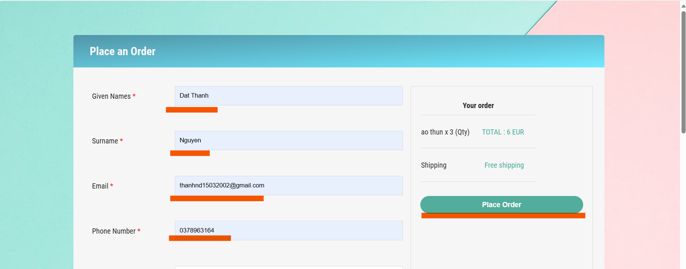
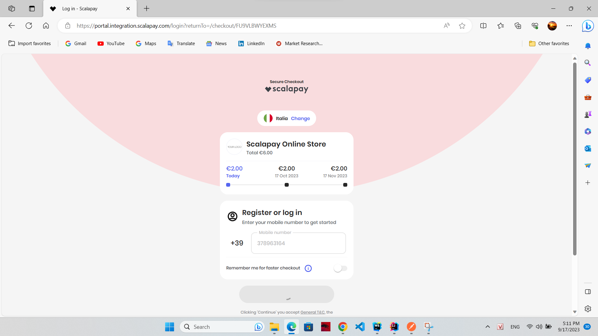
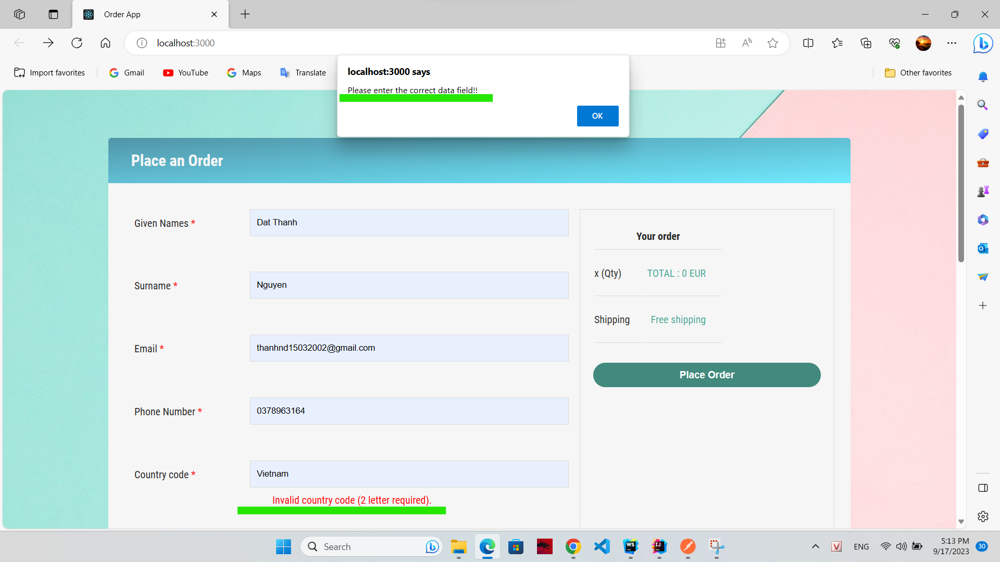

# **ORDER APP**

## Description
### This is a front-end application that allows users to enter information to order and pay via Scalapay

## Features
### There are 2 main features: place an order with Scala Pay integration API, redirect to check out URL after placing successfully

## Code Explanation
### 1. `readme.md`: declare all necessary information in our project. That includes: description, features, code explanation, how to test sections. Please read me first!
### 2. `package.json`: declare all necessary dependencies using in our project
### 3. `api/orderAPI.js`: declare the API that the backend(order-service) provides
### 4. `constant/AppContant.js` : declare the token provided by scalaPay 
### 5. `data/OrderInfoData.js` : defines user data fields when entering the form
### 6. `validator/OrderValidator.js` : defines user data entry errors
### 7. `components/order/OrderCreating.js` : render place an order form
### 8. `src/App.css` : add stylesheet for the interface

## How to test:
### 1. Run backend app(order-service)
### 2. Enter all field in form after that click button Place Order

### 2.1 Check page redirects, if you are correct, it will look like the image below :

### 2.2 This is when you enter the wrong data field : 
